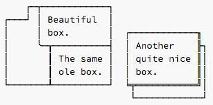
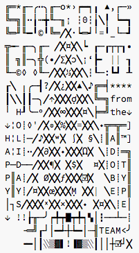

# boxDrawing.py

Soon after the public release of [Source Code Pro][scp], many a notice was received from connoisseurs of fixed-width type, upset about a shortcoming: Unbelievably, the family’s first iteration did not contain [Box Drawing Characters][boxwiki]. 
Fortunately, this flaw has since been remedied, and the whole set of Box Drawing Characters, plus all of the Block Elements now are now part of the typeface.  

[Source Code Pro][scp] is a typeface family intended for both programmers and designers. It has a fairly wide range of weights, therefore we agreed to adjust the Box Drawing Characters in their stem width as well, to make for a better corresponding appearance.
The reasoning behind this decision is that everyone will benefit from this consideration: The programmer will like the screen display adjusted to the chosen text weight. 
The graphic designer will appreciate a multitude of combination possibilities; and an unseen dynamic range of drawing boxes.

All that is why this script was written. It is not exactly an amazing, or creativity-challenging task to draw those quite generic glyphs.  
Much more fun is derived from writing a script, and generating the silliest box drawing characters over and over again.

## What does this script do?

This script will draw the complete range of Box Drawing Characters and Block Elements in the font editor of your choice.  
The design of those characters is based on a handful of parameters, which can be changed in the script file itself. 
Feel free to create Box Drawing Characters that are longer than usual; exceedingly wide, fat (both?); or hairline-thin.  

Time was spent to make this script compatible with the triumvirate of commercial font editing applications; this means that this script will run in [RoboFont][], [Glyphs][], and even [FontLab][] without any modifications.  
You can even run the script straight from the command line, which will generate a new UFO file right to your desktop.

__Tested versions:__  
Robofont: Version 1.4b (build 1302261653)  
Glyphs: Version 1.3.17 (429)  
FontLab: 5.1.3 (4693)  

__Dependencies:__  
When using Glyphs or FontLab, [Robofab][] must be installed and working.
Also, running the script from the command line will not work without Robofab installed.

## What does this script not do?

This script is not for adding Box Drawing Characters to existing, compiled fonts.  
It is assumed you have type design software, and font source data available.

## What are Box Drawing Characters?

__Box Drawing__ [Unicode range 2500-257F][box] and __Block Elements__ [Unicode range 2580-259F][block]:

|         |  0  |  1  |  2  |  3  |  4  |  5  |  6  |  7  |  8  |  9  |  A  |  B  |  C  |  D  |  E  |  F  |
| ------- | --- | --- | --- | --- | --- | --- | --- | --- | --- | --- | --- | --- | --- | --- | --- | --- |
| U+250x  |  ─  |  ━  |  │  |  ┃  |  ┄  |  ┅  |  ┆  |  ┇  |  ┈  |  ┉  |  ┊  |  ┋  |  ┌  |  ┍  |  ┎  |  ┏  |
| U+251x  |  ┐  |  ┑  |  ┒  |  ┓  |  └  |  ┕  |  ┖  |  ┗  |  ┘  |  ┙  |  ┚  |  ┛  |  ├  |  ┝  |  ┞  |  ┟  |
| U+252x  |  ┠  |  ┡  |  ┢  |  ┣  |  ┤  |  ┥  |  ┦  |  ┧  |  ┨  |  ┩  |  ┪  |  ┫  |  ┬  |  ┭  |  ┮  |  ┯  |
| U+253x  |  ┰  |  ┱  |  ┲  |  ┳  |  ┴  |  ┵  |  ┶  |  ┷  |  ┸  |  ┹  |  ┺  |  ┻  |  ┼  |  ┽  |  ┾  |  ┿  |
| U+254x  |  ╀  |  ╁  |  ╂  |  ╃  |  ╄  |  ╅  |  ╆  |  ╇  |  ╈  |  ╉  |  ╊  |  ╋  |  ╌  |  ╍  |  ╎  |  ╏  |
| U+255x  |  ═  |  ║  |  ╒  |  ╓  |  ╔  |  ╕  |  ╖  |  ╗  |  ╘  |  ╙  |  ╚  |  ╛  |  ╜  |  ╝  |  ╞  |  ╟  |
| U+256x  |  ╠  |  ╡  |  ╢  |  ╣  |  ╤  |  ╥  |  ╦  |  ╧  |  ╨  |  ╩  |  ╪  |  ╫  |  ╬  |  ╭  |  ╮  |  ╯  |
| U+257x  |  ╰  |  ╱  |  ╲  |  ╳  |  ╴  |  ╵  |  ╶  |  ╷  |  ╸  |  ╹  |  ╺  |  ╻  |  ╼  |  ╽  |  ╾  |  ╿  |
| U+258x  |  ▀  |  ▁  |  ▂  |  ▃  |  ▄  |  ▅  |  ▆  |  ▇  |  █  |  ▉  |  ▊  |  ▋  |  ▌  |  ▍  |  ▎  |  ▏  |
| U+259x  |  ▐  |  ░  |  ▒  |  ▓  |  ▔  |  ▕  |  ▖  |  ▗  |  ▘  |  ▙  |  ▚  |  ▛  |  ▜  |  ▝  |  ▞  |  ▟  |

Both Box Drawing Characters and Block Elements are mostly at home in the world of text-based UI; you might remember brilliant examples from MS-DOS Defrag or ScanDisk.

	    ┌─┬────────────┐
	┌───┘ │ Beautiful  │  
	│     │ box.       │  ┌────────────╖
	│     ╰─┰──────────┤  │ Another    ╟┐
	│       ┃ The same │  │ quite nice ║│
	│       ┃ ole box. │  │ box.       ║│
	└───────┸──────────┘  ╘╤═══════════╝│
	                       └────────────┘       

Box Drawing Characters can also be used for graphic design.
As an example, see the “source code” (pun) of the [Adobe Type Team holiday card 2012][xmas]:

	╔═*╓─╭╍╮╓─o*›┍━┑╻ ▲,┌─»
	╚═╗║╍╽┅╈╙─╖¡ ┆0┆╽╲╿ ┕━┓
	╚═╜╙━╹©╹╚═╱╳∙┕═┙╵=╹_└─┛
	╦┉╴╓─╮╓─ ╱╳¤╳╲┕ ┎─┎┬┬┒•
	║ ╗║─╮╬(•╱∑╳ɔ╲¡ʻ┣╸ || ┒
	╙─©◊ ◊╙─╱╳╳⅓╳╳╲┆┖─:┗┛ ┸
	┎╲ ╷╭─┨?╱╳¿╳╳▲╲♪╔═╡****
	┃╲╲┃┃─╮╱↑╳╳╳ợ╳╳╲╚═╗from
	╵ H┚╰─ᵒ╱╳╳∞╳╳╳¤╲╞═╝the↓
	↓╎O┊◊ˈ╱╳◉╳%╳╳=╳╳╲◆╦═╦═]
	H╎L┊─╱♪╳╳ʷ╳ ∫╳ §╲┊║A║™]
	A╎I┊╍╱╳∂╳╳◆╳╳╳Ω╳ ╲┊D┊═╗
	P─D──╱╳╳¶╳ ╳$╳  ¤╳┊O┊T║
	P║A┊╱╳ Ø╳╳ƒ╳╳╳☑╳  ╲B┊Y║
	Y║Y┊╱¤╳╳œ╳╳╳Ṃ ╳╳| ╲E┊P║
	│┐S╱╳╳╳ˣ╳╳×╳╳╳◆ ╳¤╳╲┊E│
	↓ !!┟╥─╯┍╇┯█┯╇┑▚│┇──┴─┊
	   ╶═╝┎┘│━┵┼┶━│┈╢TEAM<╯
	   ╺━│┃░▒▓▌!▐▓▒░┃││┼☑┘╳

This is how the above text should look like if your browser is using a font with proper box drawing support (e.g. [Source Code Pro][scp]):  
  

## Usage:
- Open font editor of your choice (one of the three mentioned above).
- Drag the the script file into the scripts panel.
- Run.
- Watch Box Drawing Characters emerge.
- Done.

Alternate method:

- Run the script on the command line.
- A UFO full of box drawing characters is be stored on your desktop.

[box]: http://www.unicode.org/charts/PDF/U2500.pdf
[block]: http://www.unicode.org/charts/PDF/U2580.pdf
[xmas]: http://blogs.adobe.com/typblography/files/2012/12/happy-holidays-2012.pdf
[boxwiki]: http://en.wikipedia.org/wiki/Box_drawing_characters
[scp]: https://github.com/adobe/source-code-pro
[robofont]: http://doc.robofont.com/
[glyphs]: http://glyphsapp.com/
[fontlab]: http://www.fontlab.com/font-editor/fontlab-studio/
[robofab]: http://robofab.org/

